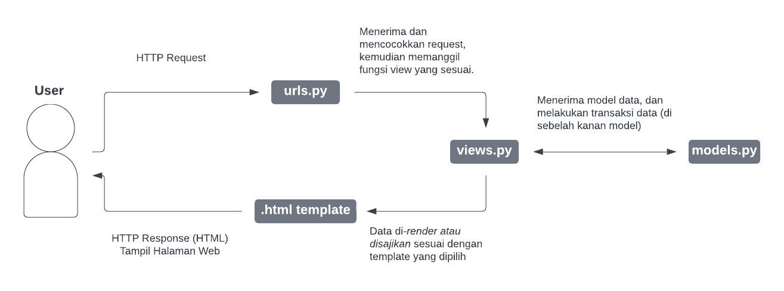
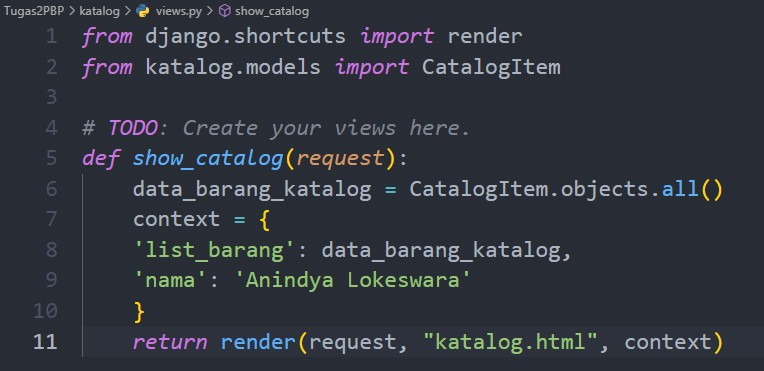
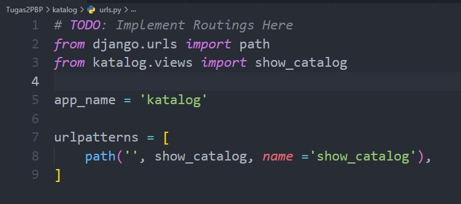
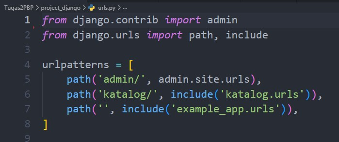
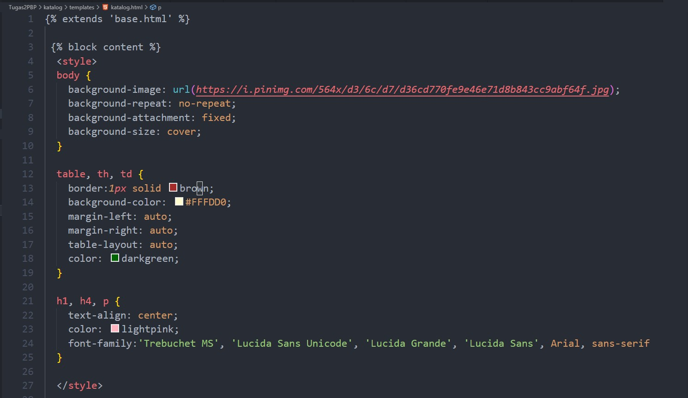
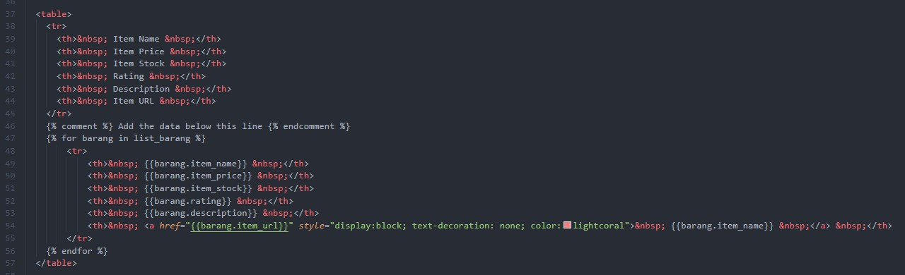

# (README) Tugas 2: Pengenalan Aplikasi Django dan Models View Template (MVT) pada Django

Pemrograman Berbasis Platform (CSGE602022) - diselenggarakan oleh Fakultas Ilmu Komputer Universitas Indonesia, Semester Ganjil 2022/2023

## Link Aplikasi Heroku
[Lab 1 Assignment PBP/PBD](http://lokeswara-pbp-tugas2.herokuapp.com/katalog/)


## Penjelasan dan demonstrasi program
(1) Bagan _request client_ dan responnya pada aplikasi web berbasis Django 



Program berjalan dengan memproses HTTP Request user pada file ```urls.py``` yang akan men-_extract_ URL dari request dan mencocokkan url tersebut dengan url yang telah terdefinisi. Apabila dikenali, maka program akan memanggil fungsi view pada file ```views.py``` yang bersesuaian (menggunakan parameter request) untuk memodelkan data berdasarkan file ```models.py``` dan menerapkan fungsi kepada data tersebut. Terakhir pada file tersebut (models.py) terjadi transaksi data, yaitu pengambilan atau pembuatan data dari database (apabila tersedia) ke dalam fungsi view dan menerapkannya ke .html template yang sesuai.
 
(2) Mengapa menggunakan virtual environment? Apakah kita tetap dapat membuat aplikasi web berbasis Django tanpa menggunakan virtual environment? <br>
"Virtual Environment adalah sebuah ruang lingkup virtual yang terisolasi dari dependencies utama", yang berarti hal - hal seperti _interpreter_, _libraries_, _scripts_ dan _dependencies_ yang terpasang di dalamnya hanya milik ruang lingkup virtual tersebut dan tidak memengaruhi dependencies utama. _Virtual environment_ tidak harus digunakan ketika membuat atau mengembangkan aplikasi web berbasis Django, tetapi sangat dianjurkan digunakan guna mengurangi konflik _dependencies_ dan memudahkan memenuhi syarat - syarat yang diperlukan pada suatu aplikasi tanpa mengubah ubah _dependencies_ utama dari waktu ke waktu.
  
(3) Implementasi pengerjaan program <br>
<br> a. Persiapan 
Setelah melakukan ```git clone``` dari template yang telah disediakan, saya menjalankan perintah ```python manage.py makemigrations``` dan ```python manage.py migrate``` pada virtual environment python untuk mempersiapkan dan menerapkan migrasi skema model ke dalam database Django lokal, serta perintah ```python manage.py loaddata initial_catalog_data.json``` untuk memasukkan data dari folder fixtures ke dalam database Django lokal. <br>
<br> b. ```views.py```



Dengan parameter request, fungsi _show_catalog_ pada views.py melakukan pengambilan data dengan perintah CatalogItem.objects.all() (memanggil fungsi query ke model database kemudian menyimpan hasil query tersebut ke dalam sebuah variabel). <br>
<br> c. ```urls.py```



Melakukan routing terhadap fungsi views (_show_catalog_) agar dapat menampilkan halaman HTML pada browser. 



Daftarkan juga aplikasi katalog ke dalam urls.py yang ada pada folder project_django dengan menambahkan potongan kode path('katalog/', include('katalog.urls')) pada variabel urlpatterns agar program dapat mengambil data sesuai dengan parameter request yang diberikan oleh user. <br>
<br> d. ```katalog.html```





Perubahan yang dilakukan pada template html, hanya dilakukan pada file ```katalog.html```, yaitu menerapkan style block untuk mendesain page html dan menerapkan iterasi pada list_barang untuk memetakan data dari initial_catalog_data.json ke dalam template tabel yang telah diberikan. <br>

e. Deploy ke Heroku
Setelah melakukan seluruh perubahan pada file - file diatas, maka pada direktori yang sama kembali melakukan perintah ```git add```, ```git commit```, dan ```git push``` untuk melakukan pembaharuan pada repositori github. Setelah itu membuat aplikasi pada website heroku dan juga membuat Secrets Key agar Deploy ke Heroku berjalan dengan Lancar

referensi: <br>
https://data-flair.training/blogs/django-request-response-cycle/
https://docs.python.org/3/library/venv.html#:~:text=A%20virtual%20environment%20is%20a,part%20of%20your%20operating%20system.
https://dev.notnoob.com/tutorial-virtual-environment/
