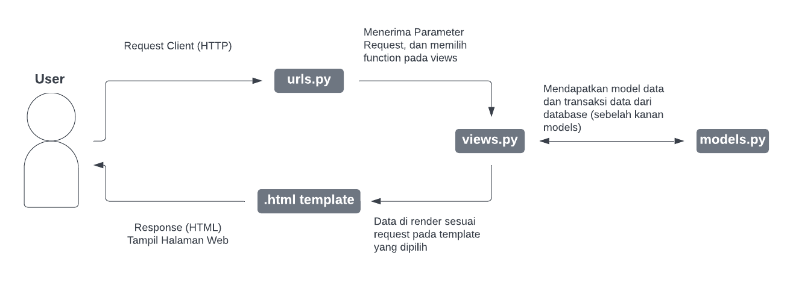

# (README) Tugas 2: Pengenalan Aplikasi Django dan Models View Template (MVT) pada Django

Pemrograman Berbasis Platform (CSGE602022) - diselenggarakan oleh Fakultas Ilmu Komputer Universitas Indonesia, Semester Ganjil 2022/2023

## Link Aplikasi Heroku
[Lab 1 Assignment PBP/PBD](http://lokeswara-pbp-tugas2.herokuapp.com/katalog/)

## Penjelasan dan demonstrasi program
(1) Bagan _request client_ dan responnya pada aplikasi web berbasis Django  

