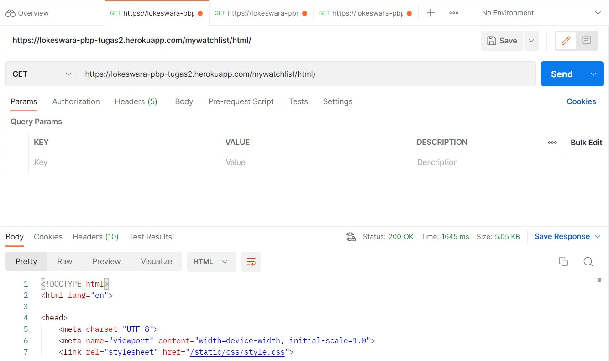
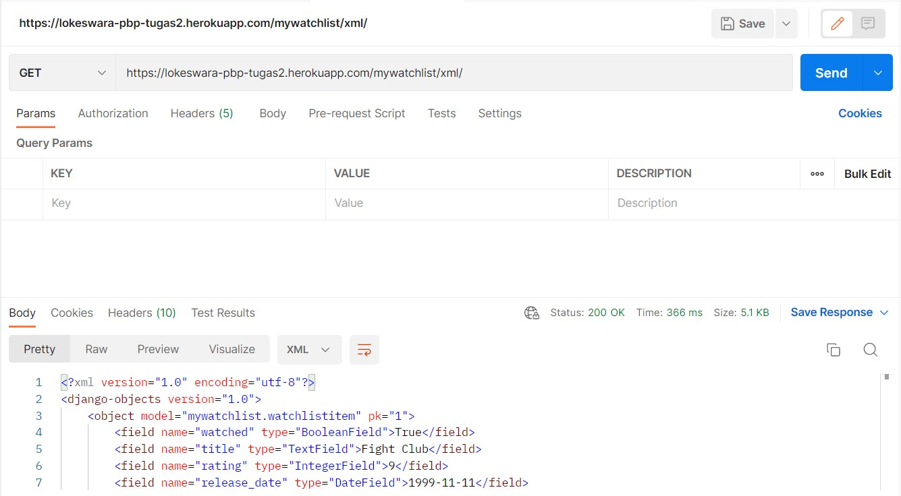
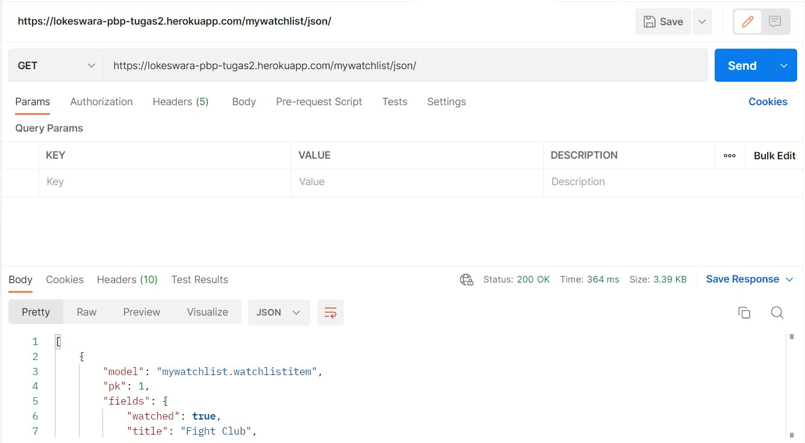

# (README) Tugas 3: Pengimplementasian Data Delivery Menggunakan Django

Pemrograman Berbasis Platform (CSGE602022) - diselenggarakan oleh Fakultas Ilmu Komputer Universitas Indonesia, Semester Ganjil 2022/2023

## Link Aplikasi Heroku
[HTML](http://lokeswara-pbp-tugas2.herokuapp.com/mywatchlist/html/)
[XML](http://lokeswara-pbp-tugas2.herokuapp.com/mywatchlist/xml/)
[JSON](http://lokeswara-pbp-tugas2.herokuapp.com/mywatchlist/json/)

## Penjelasan dan demonstrasi program
(1) Jelaskan perbedaan antara JSON, XML, dan HTML!  
(2) Jelaskan mengapa kita memerlukan data delivery dalam pengimplementasian sebuah platform?  
(3) Jelaskan bagaimana cara kamu mengimplementasikan checklist di atas.  

#### URL "/mywatchlist/html" berhasil mengembalikan respon HTTP 200 OK
  

#### URL "/mywatchlist/xml" berhasil mengembalikan respon HTTP 200 OK
  

#### URL "/mywatchlist/json" berhasil mengembalikan respon HTTP 200 OK
  

