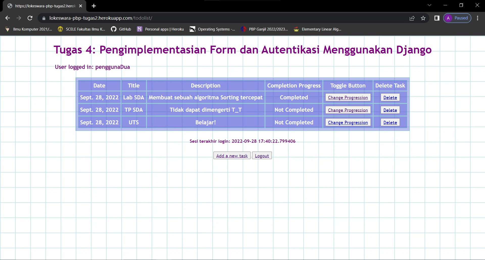

# (README) Tugas 4: Pengimplementasian Form dan Autentikasi Menggunakan Django

Pemrograman Berbasis Platform (CSGE602022) - diselenggarakan oleh Fakultas Ilmu Komputer Universitas Indonesia, Semester Ganjil 2022/2023

## Link Aplikasi Heroku
[App To Do List](https://lokeswara-pbp-tugas2.herokuapp.com/todolist/)

## Penjelasan dan demonstrasi program
(1) Apa kegunaan  pada elemen <form>? Apa yang terjadi apabila tidak ada potongan kode tersebut pada elemen <form>? <br>

Cross-Site Request Forgery (CSRF) token adalah sebuah _secure random token (e.g., synchronizer token or challenge token)_ yang digunakan untuk menentukan apabila HTTP request yang diterima benar dihasilkan melalui _user interface_ dari aplikasi tersebut. Singkatnya, CRSF token bekerja dengan cara melakukan verifikasi terhadap _end-user request_ dnmana request yang di-_generate_ dari browser tersebut harus mengandung CRSF token yang bersangkutan dan server aplikasi akan menolak _request_ apabila CRSF token gagal memenuhi verifikasi tersebut. <br>

Apabila CSRF token tidak digunakan di dalam potongan kode yang dibutuhkan, seharusnya aplikasi tetap dapat berjalan sesuai dengan maksudnya, tetapi aplikasi menjadi sangat rentan untuk terkena _CSRF attack_ (Seseorang selain user dapat mengakses halaman yang seharusnya tidak dapat diakses / memerlukan kondisi khusus untuk diakses) sehingga dampaknya adalah mengalami kerugian data yang seharusnya bisa dihindari dengan mudah. <br>

(2) Apakah kita dapat membuat elemen <form> secara manual (tanpa menggunakan generator seperti {{ form.as_table }})? Jelaskan secara gambaran besar bagaimana cara membuat <form> secara manual. <br>

(3) Jelaskan proses alur data dari submisi yang dilakukan oleh pengguna melalui HTML form, penyimpanan data pada database, hingga munculnya data yang telah disimpan pada template HTML. <br>
  
(4) Jelaskan bagaimana cara kamu mengimplementasikan checklist di atas. <br>

Langkah - langkah yang dilakukan dalam pengerjaan checklist tugas 4, antara lain: <br>

(a) Pada direktori yang sama dengan tugas sebelumnya, saya masuk kedalam _virtual environment_ kemudian menjalankan perintah ```python manage.py startapp "app_name"``` untuk menambahkan folder app_name (todolist) beserta isinya sesuai dengan template yang telah disediakan. <br>

(b) Pada folder project_django, saya menambahkan app_name kedalam list installed_apps pada file settings.py dan juga menambahkan path 'todolist/' pada file urls.py yang juga include seluruh urlpatterns pada urls.py di folder todolist. <br>

(c) Dengan import models dari django.db, saya membuat class object TaskItem dengan seluruh attributes yang diminta pada soal. <br>

(d) Implementasi form registrasi, login, dan logout dilakukan beracuan pada materi yang diberikan pada lab3, dengan menyesuaikan data pada views.py yang diperlukan <br>

(e) Membuat file baru yaitu forms.py yang akan berfungsi meminta dan menerima input untuk data objek TaskItem, Serta menyiapkan semua html file yang diperlukan (Data dan fungsi untuk verifikasi dibuat ke dalam views.py) <br>
  
(f) Melengkapi file views.py dan menyiapkan seluruh routing yang diperlukan dari fungsi views.py , serta menghubungkan kode tersebut dengan file html. <br>

(g) Untuk melakukan deploy,  saya melakukan git add, commit, dan push ke repositori tugas pbp yang sama seperti sebelumnya. <br>

(h) Setelah deploy berhasil, saya melakukan pengecekan pada link app heroku yang telah di deploy apakah berjalan dengan lancar <br>

(i) Terakhir, saya menambahkan dari referensi yang saya baca dan membuat file README.md pada repositori github ini. <br>


#### Account Dummy Pertama
 <br>

#### Account Dummy Kedua
 <br>


#### Referensi:
 https://www.synopsys.com/glossary/what-is-csrf.html#:~:text=A%20CSRF%20token%20is%20a,token%20for%20every%20user%20session.
